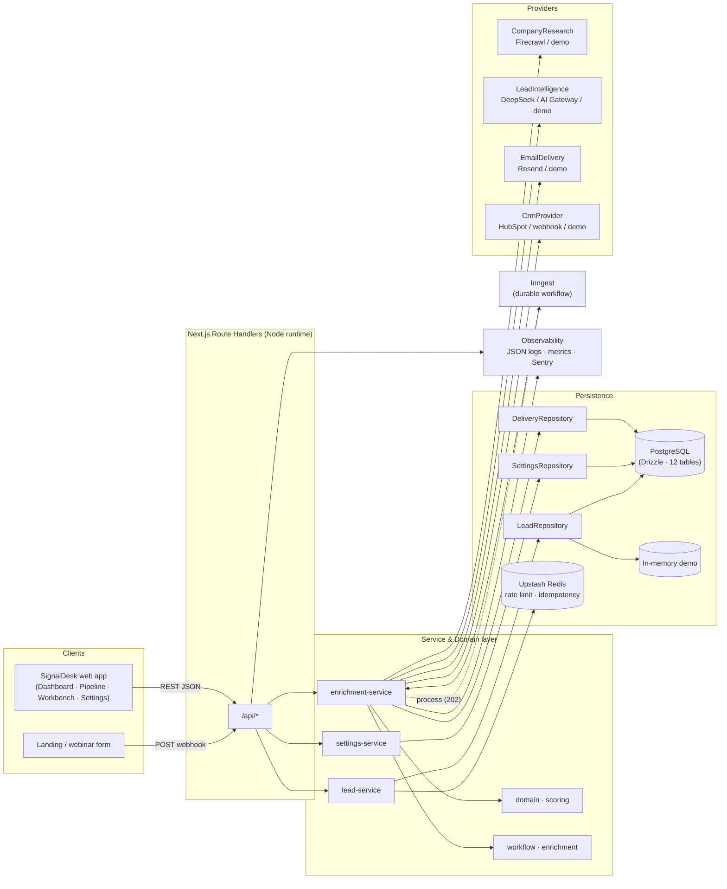
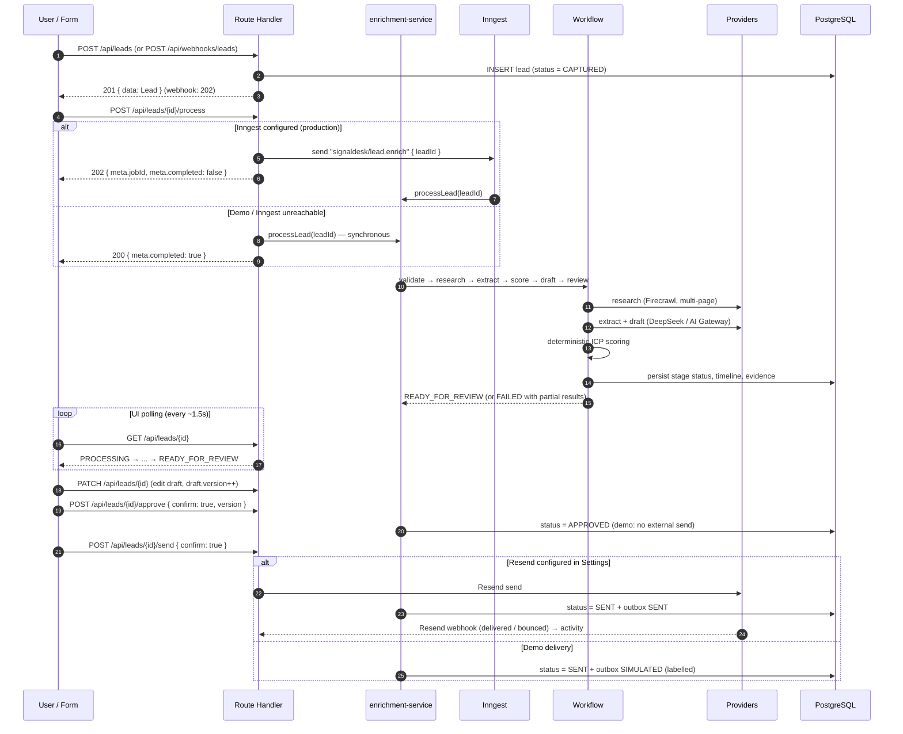
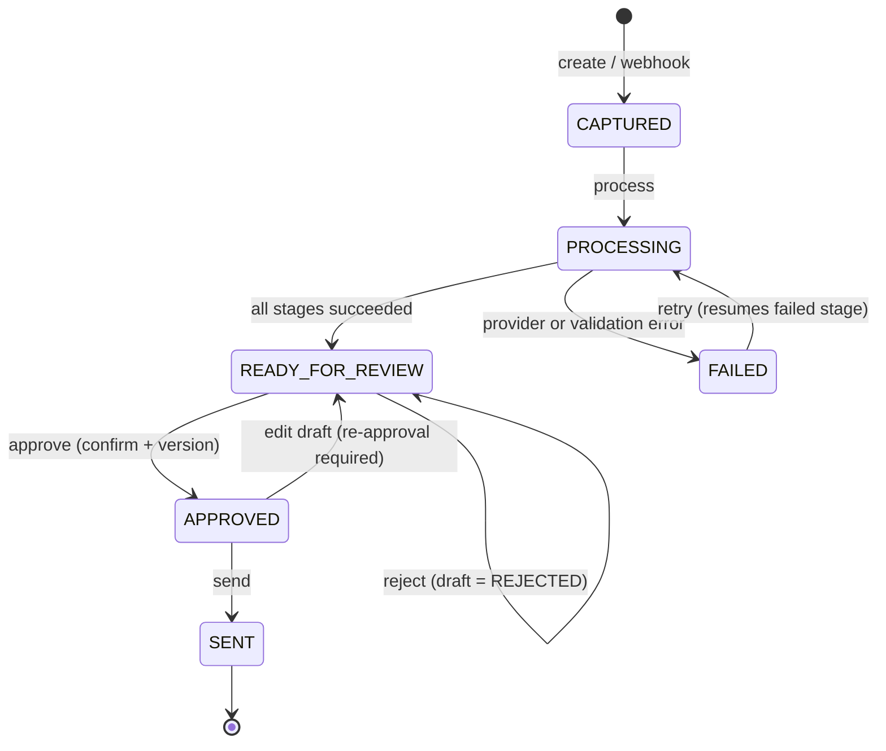
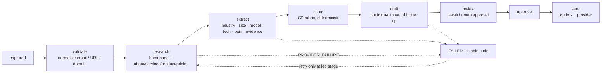
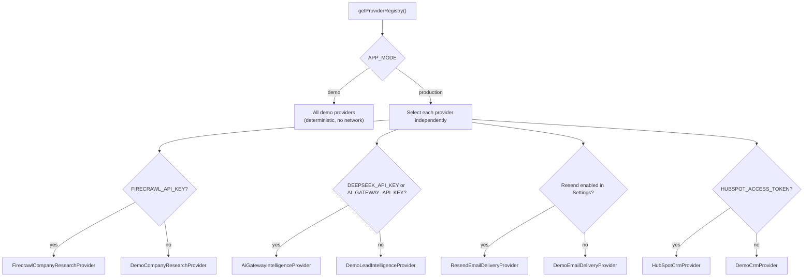
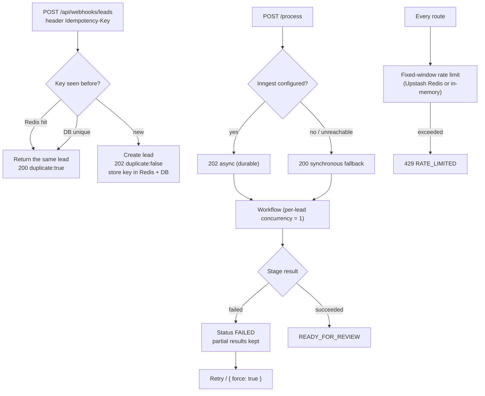
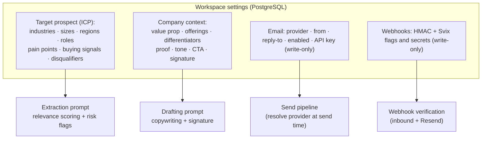
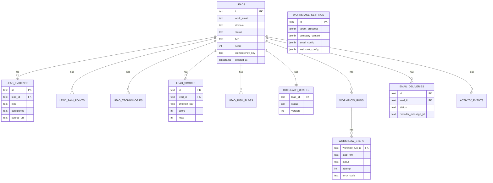
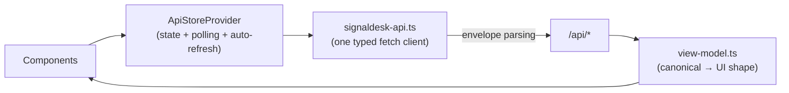

# SignalDesk

**Autonomous B2B lead enrichment & hyper-personalized inbound nurturing engine.**

SignalDesk receives an inbound lead, normalizes it, researches the company, builds
evidence-backed company intelligence, scores ICP fit with a transparent rubric,
drafts a contextual inbound follow-up, and then **stops for human approval** before
anything is sent.


---

## Table of contents

- [Overview](#overview)
- [Highlights](#highlights)
- [Architecture](#architecture)
- [Lead lifecycle](#lead-lifecycle)
- [Enrichment workflow & ICP scoring](#enrichment-workflow--icp-scoring)
- [Provider strategy (demo vs production)](#provider-strategy-demo-vs-production)
- [Reliability: idempotency, retries & rate limiting](#reliability-idempotency-retries--rate-limiting)
- [Settings, guardrails & prompt injection](#settings-guardrails--prompt-injection)
- [Tech stack](#tech-stack)
- [Getting started](#getting-started)
- [Environment variables](#environment-variables)
- [Database & migrations](#database--migrations)
- [API reference](#api-reference)
- [Data model](#data-model)
- [Frontend integration](#frontend-integration)
- [Observability & metrics](#observability--metrics)
- [Testing](#testing)
- [Project structure](#project-structure)
- [Security](#security)
- [Deployment](#deployment)
- [Roadmap & known limitations](#roadmap--known-limitations)

---

## Overview

Most lead workflows fail in the same place: research is slow, qualification is
inconsistent, and follow-ups are generic. SignalDesk closes that loop without
removing human control.

The system is **event-driven** and **provider-agnostic**:

- Route Handlers own HTTP concerns only (validation, rate limiting, envelopes).
- Business rules live in the service/domain layer.
- External providers (research, AI, email, CRM) sit behind interfaces with a
  deterministic **demo** implementation and a **production** implementation.
- **Structured AI output is re-validated with Zod** before it is ever persisted.
- **Scores and tier are computed by the backend**, never trusted from the model.
- **No email is ever sent without explicit human approval.**

The repository ships with a complete demo path that runs with **zero external
credentials**, and degrades gracefully to it whenever a credential is missing.

---

## Highlights

- 🧠 **Evidence-backed enrichment** — every insight is labelled `source` or
  `inference`; nothing is presented as fact without evidence.
- 🎯 **Explainable ICP scoring** — a fixed 100-point rubric with per-criterion
  rationale, deterministic and auditable.
- ✍️ **Contextual drafting** — the draft is generated from your own
  *company context* (value proposition, offerings, proof, tone, CTA, signature).
- 🛡️ **Human-in-the-loop** — approval is required before delivery; delivery is a
  separate, explicit action.
- 🔁 **Durable orchestration** — Inngest runs enrichment asynchronously with
  per-lead concurrency and retries; a synchronous fallback keeps local dev usable.
- 📬 **Auditable outbox** — every send attempt (real or demo) is recorded with a
  status and provider message id.
- 🧩 **Provider abstraction** — Firecrawl, DeepSeek / AI Gateway, Resend and
  HubSpot are swappable behind interfaces.
- ⚙️ **Workspace settings** — ICP, company context, email and webhook signing are
  configured from the UI and injected into prompts.
- 🔒 **Safety first** — secrets stay server-side, are never returned by the API,
  PII is masked in logs, and webhooks can be HMAC/Svix verified.

---

## Architecture



**Separation of concerns**

- **Route handlers** — parse/validate input, apply rate limits, wrap responses in
  the shared envelope, translate errors to safe HTTP responses.
- **Services** — orchestrate domain rules and persistence; no HTTP awareness.
- **Domain** — pure, deterministic logic (scoring, risk flags, workflow state).
- **Providers** — isolated integrations behind interfaces with demo fallbacks.
- **Repositories** — persistence abstraction; PostgreSQL in production, an
  in-memory store with a deterministic seed in demo mode.

---

## Lead lifecycle



**Status machine**



---

## Enrichment workflow & ICP scoring

Every stage records **status, attempt, start/completion time, duration and a
stable error code**. Retries only re-run the failed or pending stage; successful
stages are never recomputed unless `force` is requested.



### ICP scoring rubric (total = 100)

| Criterion | Max | Weight | Notes |
|---|---:|---:|---|
| Company fit | 35 | 35% | Industry, size, region, business model. |
| Problem fit | 30 | 30% | Alignment with your documented pain points. |
| Buying signal | 20 | 20% | Hiring, funding, rebrand, tooling change, expansion. |
| Data confidence | 15 | 15% | Evidence quality; free-email lowers it. |

| Tier | Score range |
|---|---|
| `HIGH_PRIORITY` | 75 – 100 |
| `MEDIUM` | 45 – 74 |
| `DISQUALIFIED` | 0 – 44 |
| `UNASSESSED` | not yet scored |

> The LLM may **suggest** per-criterion values, but the backend clamps each
> value, sums the total, derives the tier, and stores a rubric version.

---

## Provider strategy (demo vs production)

Every provider has a deterministic **demo** adapter and a **production** adapter.
In `production` mode each provider is selected **independently**, so a single
missing credential only degrades that capability — it never breaks the app.



> **Graceful degradation is a feature.** The demo path needs no credentials, makes
> no external calls, produces deterministic output, and never sends real email.

---

## Reliability: idempotency, retries & rate limiting



- **Webhook idempotency** — `Idempotency-Key` is checked in Redis (cross-instance)
  and enforced by a unique constraint in the database.
- **Workflow idempotency** — succeeded stages are skipped; approved drafts are
  never regenerated; `force: true` re-runs explicitly.
- **Retries** — Inngest retries with per-lead concurrency (`limit = 1`), so a lead
  can never have two active runs.
- **Rate limiting** — fixed-window, per bucket, per client; backed by Upstash
  Redis with an in-memory fallback.

---

## Settings, guardrails & prompt injection

The **Settings** area has five tabs: *Target prospect*, *Company context*,
*Email*, *Webhooks* and *System*.



**AI guardrails**

- Never invent funding, headcount, customers, technologies or news.
- Facts must come from the provided pages; otherwise label them `inference`.
- `estimatedSize` / `location` are `Unknown` unless stated; technologies are only
  included when explicitly evidenced or detected from page markup.
- Website content is treated as **untrusted data**; the model is instructed never
  to follow instructions found inside it.
- The draft is positioned as an inbound follow-up, keeps a light CTA, respects the
  configured tone, and signs with the configured signature.
- Structured output is validated with Zod before persistence (and re-validated at
  the boundary).

---

## Tech stack

| Concern | Technology |
|---|---|
| Framework | Next.js 16 (App Router, Route Handlers, Turbopack) |
| Runtime | Node.js |
| Language | TypeScript (strict) |
| Validation | Zod |
| Database | PostgreSQL + Drizzle ORM / Drizzle Kit |
| Durable workflow | Inngest |
| Cache / rate limit | Upstash Redis (in-memory fallback) |
| Website research | Firecrawl (map + multi-page scrape) |
| AI | Vercel AI SDK · DeepSeek or Vercel AI Gateway (structured output) |
| Email | Resend (Svix-signed webhooks) |
| CRM | HubSpot (or a generic webhook) |
| Error monitoring | Sentry (optional) |
| Testing | Vitest |

---

## Getting started

### Prerequisites

- Node.js **20.9+**
- npm
- *(optional, production)* PostgreSQL, Upstash Redis, Inngest, Firecrawl,
  DeepSeek/AI Gateway, Resend, HubSpot.

### Demo mode (no credentials)

```bash
npm install
npm run dev
```

Open `http://localhost:3000`. The app uses deterministic demo providers, an
in-memory repository with a seed, and **never sends real email**.

### Production mode

```bash
cp .env.example .env.local   # then fill in the values you need
npm run db:generate          # generate SQL from the Drizzle schema
npm run db:migrate           # apply migrations to DATABASE_URL
npm run build
npm start
```

`APP_MODE=production` activates real adapters. Any missing credential degrades
only that provider back to demo. `GET /api/health` reports `status: degraded`
(with `missingConfiguration`) when a required credential is absent, and
`STRICT_STARTUP=true` turns that into a hard startup failure.

### Useful scripts

| Command | Purpose |
|---|---|
| `npm run dev` | Start the dev server. |
| `npm run build` / `npm start` | Build and run production. |
| `npm run typecheck` | TypeScript strict check. |
| `npm run lint` | ESLint (flat config). |
| `npm test` | Unit, service and contract tests (Vitest). |
| `npm run db:generate` / `npm run db:migrate` | Drizzle migrations. |

---

## Environment variables

Copy `.env.example` to `.env.local`. Demo mode needs **none** of these.

| Variable | Mode | Purpose |
|---|---|---|
| `APP_MODE` | both | `demo` (default) or `production`. |
| `STRICT_STARTUP` | production | Fail startup when required credentials are missing. |
| `DATABASE_URL` | production | PostgreSQL connection string. |
| `UPSTASH_REDIS_REST_URL` / `UPSTASH_REDIS_REST_TOKEN` | production | Cross-instance idempotency & rate limiting. |
| `INNGEST_EVENT_KEY` / `INNGEST_SIGNING_KEY` | production | Durable workflow dispatch & verification. |
| `INNGEST_DEV` | local | Route events to a local Inngest dev server. |
| `FIRECRAWL_API_KEY` | production | Website research. |
| `AI_GATEWAY_API_KEY` | production | Vercel AI Gateway model access. |
| `DEEPSEEK_API_KEY` | production | Direct DeepSeek access (alternative to the gateway). |
| `AI_MODEL` | production | Model id, e.g. `deepseek-chat` or `deepseek/deepseek-chat`. |
| `RESEND_API_KEY` / `RESEND_FROM_EMAIL` | production | Email delivery. |
| `RESEND_WEBHOOK_SECRET` | production | Svix signature for delivery webhooks. |
| `HUBSPOT_ACCESS_TOKEN` / `CRM_WEBHOOK_URL` | production | CRM sync. |
| `WEBHOOK_SIGNING_SECRET` | production | HMAC for inbound lead webhooks. |
| `SENTRY_DSN` | production | Error monitoring. |

> Email provider, from-address and webhook secrets can also be configured from
> **Settings** (stored in PostgreSQL). Database values take precedence over the
> environment. Secrets are **write-only** — the API returns `hasApiKey` /
> `hasInboundSecret` booleans, never the value.

---

## Database & migrations

The schema is defined with Drizzle in `src/lib/server/db/schema.ts` and lives in
`drizzle/`. Reveal the schema with:



Tables: `leads`, `lead_evidence`, `lead_pain_points`, `lead_technologies`,
`lead_scores`, `lead_risk_flags`, `outreach_drafts`, `workflow_runs`,
`workflow_steps`, `activity_events`, `workspace_settings`, `email_deliveries`.

---

## API reference

All endpoints share a single envelope and are served from the same origin (no
CORS configuration required).

**Success**

```json
{ "data": {}, "meta": {} }
```

**Error**

```json
{
  "error": {
    "code": "VALIDATION_ERROR",
    "message": "One or more fields are invalid",
    "fields": { "workEmail": ["Enter a valid email address"] }
  }
}
```

| Method & path | Description |
|---|---|
| `GET /api/health` | Mode, uptime, lead count, provider & infrastructure status (no secrets). |
| `GET /api/dashboard` | KPIs, priority queue, funnel, automation health, activity feed. |
| `GET /api/metrics` | Counters, latency (median / p95) and rate metrics. |
| `GET /api/leads?q=&tier=&status=&limit=&offset=` | List leads with filters + `meta`. |
| `POST /api/leads` | Create a lead (`201`, status `CAPTURED`). |
| `GET /api/leads/{id}` | Fetch one canonical lead. |
| `PATCH /api/leads/{id}` | Save draft/contact changes (`draft.version++`). |
| `POST /api/leads/{id}/process` | Run/retry enrichment (`{ "force": true }` optional). |
| `POST /api/leads/{id}/approve` | Explicit approval (`confirm`, optional `version`, `subject`, `body`). |
| `POST /api/leads/{id}/reject` | Reject the draft; the lead returns to review. |
| `POST /api/leads/{id}/send` | Send the approved draft (`{ "confirm": true }`). |
| `GET /api/outbox` | Delivery history (`SENT` / `SIMULATED` / `FAILED`). |
| `GET /api/settings` / `PUT /api/settings` | Read/update workspace settings (secrets write-only). |
| `POST /api/demo/seed` / `POST /api/demo/reset` | Load or clear the sample workspace. |
| `POST /api/webhooks/leads` | Inbound webhook (`Idempotency-Key`, optional HMAC). |
| `POST /api/webhooks/resend` | Resend delivery webhook (Svix-signed). |
| `GET`/`POST`/`PUT /api/inngest` | Inngest serve handler. |

**Status codes**

| Status | Meaning |
|---|---|
| `200` | Success (read / update / approval / synchronous workflow). |
| `201` | Lead created. |
| `202` | Asynchronous workflow / webhook accepted. |
| `400` | Invalid JSON or payload. |
| `401` | Invalid webhook signature. |
| `404` | Lead not found. |
| `409` | Invalid state transition or draft version conflict. |
| `422` | Valid shape but business rule not met (e.g. empty draft). |
| `429` | Rate limit exceeded. |
| `502` | External provider failed in a mapped way. |
| `503` | Required provider unavailable / not configured. |

**Rate limits (per client, per minute)**

| Bucket | Limit | Bucket | Limit |
|---|---:|---|---:|
| `leads:list` | 120 | `approve` | 60 |
| `leads:create` | 30 | `reject` | 60 |
| `leads:get` | 240 | `send` | 30 |
| `leads:update` | 60 | `webhook:leads` | 120 |
| `process` | 60 | `settings:update` | 30 |

---

## Data model

The canonical contract lives in `src/contracts/**` and is imported by both the
frontend and the backend. There is a single `Lead` type; no duplicate models.

- **Enums** — `Tier`, `LeadStatus`, `StepStatus`, `DraftStatus`, `DeliveryStatus`.
- **`Lead`** — `contact`, `company`, `qualification` (score, tier, reasoning,
  criteria, risk flags), `enrichment` (summary, pain points, technologies,
  evidence, confidence), `draft` (subject, body, status, version), `workflow`
  (current stage, steps, attempts, duration), `status`, timestamps,
  `idempotencyKey`.
- **Evidence** is explicitly typed as `kind: "source" | "inference"` with
  `confidence: high | medium | low` and an optional `sourceUrl`.

All values crossing the network are JSON-serializable; timestamps are always ISO
8601 strings (the PostgreSQL adapter normalizes driver output).

---

## Frontend integration



- `src/lib/client/signaldesk-api.ts` — a single typed client. Components never
  build URLs or parse the envelope themselves.
- `src/lib/client/view-model.ts` — maps canonical contracts to the UI view-model.
- `src/components/providers/api-store.tsx` — loads `/api/leads` + `/api/dashboard`,
  handles create/process/save/approve/send/reject, polls `PROCESSING` leads and
  auto-refreshes every ~12s.
- A demo store remains available as an explicit fallback and is used automatically
  if the API is unreachable.

---

## Observability & metrics

- **Structured JSON logs** (one line per event) with a correlation id resolved
  from `x-request-id` / `x-correlation-id`, plus `leadId`, `workflowRunId`,
  `provider`, `durationMs`, `outcome` and `errorCode`.
- **PII masking** — emails are masked and secret-looking fields are redacted
  before logging.
- **Metrics** — `GET /api/metrics` exposes lead ingestion, enrichment success and
  failure counts, draft approvals, emails sent/failed, plus median/p95 enrichment
  latency and derived rates.
- **Sentry** — optional; initialized from `instrumentation.ts` only when
  `SENTRY_DSN` is set. Monitoring failures never break a request.

`GET /api/health` exposes per-provider mode/credential presence and infrastructure
flags (database, Redis, Inngest) without revealing any secret value.

---

## Testing

```bash
npm test
```

The suite (Vitest) covers:

- **Unit** — email/domain/website normalization, free-email risk flag, scoring
  boundaries (0 / 44 / 45 / 74 / 75 / 100), tier calculation, evidence
  source/inference invariants, timestamp ISO format.
- **Service** — create/list/get/update, case-insensitive filtering, workflow
  success and partial failure, retry of only the failed stage, duplicate webhook
  idempotency, approval idempotency and version conflict, reject, send guards.
- **Contract** — response envelope shape, error mapping (no leaks), and route
  handlers returning the shared envelope.
- **Production adapters (mocked)** — HubSpot upsert, provider failure → `502`,
  rate limiting → `429`, log redaction.

Tests run in demo mode with credentials cleared, so they never touch a real
database or a paid API.

---

## Project structure

```text
src/
├── app/
│   ├── (dashboard)/            # Overview, leads, workbench, analytics, outbox, settings
│   └── api/                    # Route handlers (Node runtime)
├── components/                 # UI (navigation, dashboard, leads, settings, outbox…)
├── contracts/                  # Shared types, enums, Zod schemas, API envelope
├── data/                       # Deterministic seed
└── lib/
    ├── client/                 # API client + view-model mapping
    └── server/
        ├── cache/              # Redis KV, rate limiting, idempotency
        ├── db/                 # Drizzle schema + client
        ├── domain/             # scoring, risk, workflow, errors, response helpers
        ├── inngest/            # client + durable function
        ├── observability/      # context, logger, metrics, Sentry
        ├── providers/          # demo/ + production/ + registry & health
        ├── repositories/       # lead / settings / delivery (Postgres + memory)
        ├── services/           # lead, enrichment, settings, email, demo, outbox
        └── workflows/          # enrichment orchestrator
drizzle/                        # SQL migrations
docs/                           # runbook + architecture notes
```

---

## Security

- Secrets live in environment variables or write-only Settings fields; the API
  never returns them.
- Webhooks can be verified: HMAC-SHA256 (`X-SignalDesk-Signature`, constant-time)
  for inbound leads, Svix for Resend delivery events.
- Logs mask PII and redact secret-looking fields; error responses never include
  stack traces, prompts or provider keys.
- Rate limiting protects create, process, approve, reject, send and webhooks.
- Raw website content is treated as untrusted input and is not persisted beyond
  the derived evidence.

---

## Deployment

1. Provision PostgreSQL (e.g. Neon) and Upstash Redis; run `npm run db:migrate`.
2. Set the production environment variables (see the table above).
3. Deploy to a Next.js-compatible host (e.g. Vercel) and register the Inngest app
   at `POST /api/inngest`.
4. Point the Resend delivery webhook at `POST /api/webhooks/resend`.
5. Verify `GET /api/health` returns `status: ok` with all providers green.

Operational procedures (incident playbooks, rollback, provider setup) are in
[`docs/runbook.md`](docs/runbook.md).

---

## Roadmap & known limitations

- **Authentication / multi-tenancy** is out of scope for the MVP (single demo
  workspace).
- The demo outbox records `SIMULATED` deliveries; configure Resend in Settings for
  real delivery.
- Metrics are in-process per instance; forward the endpoint to your APM for
  fleet-wide aggregation.
- Research focuses on the most relevant pages discovered by Firecrawl (homepage +
  about/services/product/pricing); deeper crawling can be enabled per need.
- A UI view-model layer still maps canonical contracts to the component shape.

---

<p align="center"><sub>SignalDesk — built as a portfolio-grade Automation &amp; Growth Engineering project.</sub></p>
