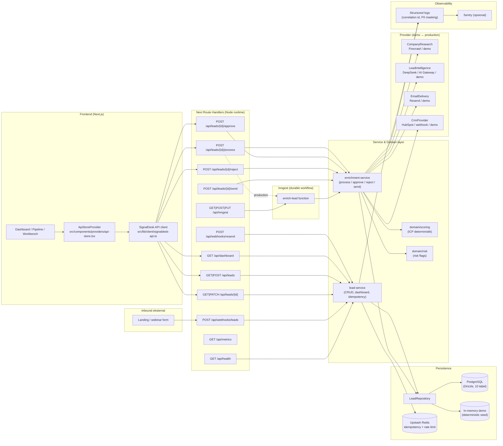
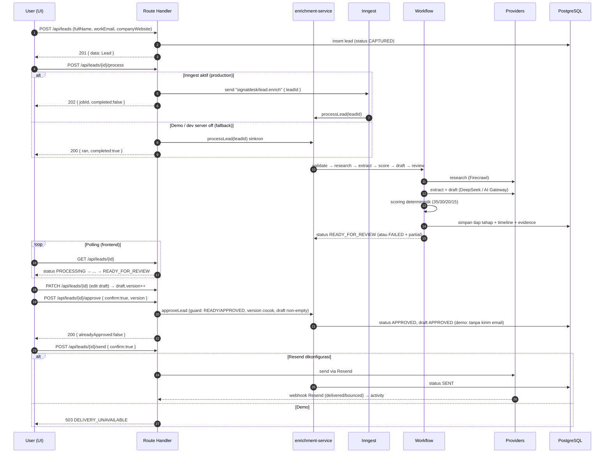
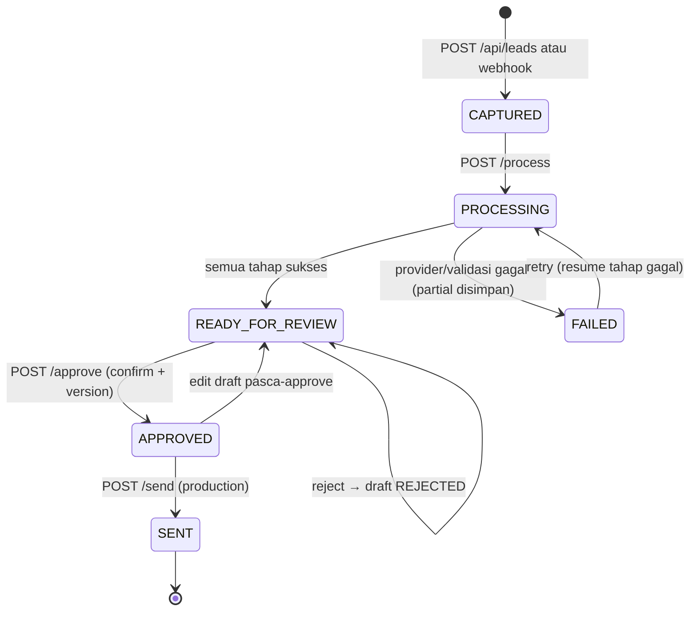
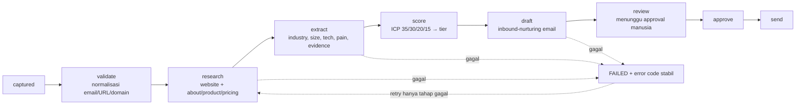
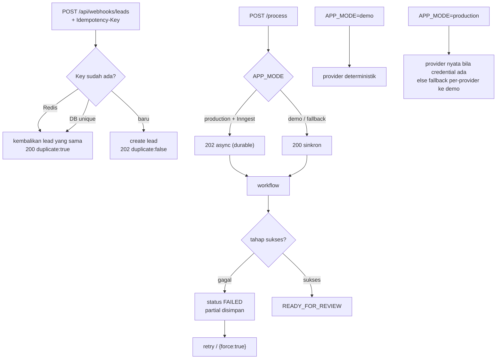

# SignalDesk — Alur Sistem (Mermaid)

Dokumen ini menjelaskan alur backend SignalDesk sesuai implementasi saat ini
(Phase 1–4). Cocok dilihat di viewer Markdown yang mendukung Mermaid.

## 1. Arsitektur keseluruhan

## 2. Alur end-to-end sebuah lead

## 3. State machine status lead

## 4. Tahapan workflow enrichment

## 5. Idempotency, retry, dan mode

