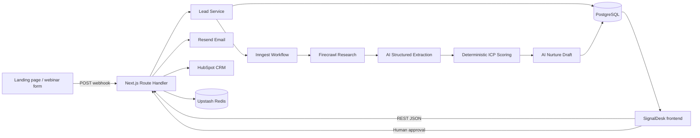

# Backend Brief — SignalDesk Lead Enrichment & Inbound Nurturing Engine

## 1. Ringkasan proyek

SignalDesk adalah backend event-driven yang menerima lead inbound, menormalisasi data, meneliti perusahaan, menyusun company intelligence berbasis bukti, menghitung kecocokan ICP, membuat draf email nurturing, lalu berhenti untuk meminta approval manusia sebelum email dapat dikirim.

Backend harus mendukung dua cara kerja:

- **Demo mode:** dapat digunakan tanpa API key eksternal, menghasilkan data deterministik, dan tidak pernah mengirim email sungguhan.
- **Production mode:** menggunakan PostgreSQL, Inngest, Firecrawl, AI Gateway, Resend, HubSpot, serta Redis untuk proses yang durable dan dapat diaudit.

Frontend SignalDesk sudah menyediakan halaman dashboard, pipeline, form, detail lead, draft editor, approval, dan workflow timeline. Backend harus mengikuti kontrak bersama di `src/contracts/**` agar frontend dan backend menggunakan tipe data yang sama.

## 2. Tujuan bisnis

- Mengurangi waktu dari form submission ke draf follow-up dari hitungan jam menjadi kurang dari satu menit.
- Mengurangi riset manual SDR tanpa menghilangkan kontrol manusia.
- Memprioritaskan lead menggunakan rubric ICP yang konsisten dan dapat dijelaskan.
- Menghasilkan pesan inbound yang kontekstual tanpa mengarang fakta perusahaan.
- Menyediakan audit trail untuk setiap data, keputusan skor, retry, approval, dan pengiriman.

## 3. Di luar ruang lingkup MVP

- Autentikasi multi-tenant dan billing.
- Scraping LinkedIn tanpa izin.
- Pengiriman cold-email massal.
- AI yang boleh mengirim email tanpa approval manusia.
- Training model AI sendiri.
- Sinkronisasi dua arah penuh dengan seluruh CRM.

## 4. Arsitektur sistem



Prinsip arsitektur:

- Route handler hanya menangani HTTP, validasi, dan response.
- Aturan bisnis berada di service/domain layer.
- Provider eksternal berada di belakang interface agar bisa diganti atau dimock.
- Workflow tidak menyimpan secret atau memanggil browser API.
- Structured output dari AI selalu divalidasi ulang dengan Zod.
- Total skor dan tier dihitung backend, bukan dipercaya langsung dari LLM.

## 5. Teknologi yang digunakan

### 5.1 Stack inti yang sudah digunakan di repository

| Kebutuhan | Teknologi | Fungsi |
|---|---|---|
| Full-stack framework | Next.js 16 App Router | Menyediakan frontend dan REST Route Handlers dalam satu deployment. |
| Server runtime | Node.js runtime | Mendukung database driver, provider SDK, crypto, dan background integration. |
| Bahasa | TypeScript strict | Menjaga kontrak frontend-backend dan domain tetap type-safe. |
| Validasi | Zod | Memvalidasi request, query, environment, webhook, dan structured AI output. |
| API contract | `src/contracts/**` | Satu sumber tipe dan enum yang digunakan frontend serta backend. |
| Demo repository | In-memory repository + deterministic seed | Menjalankan portfolio tanpa credential eksternal. |
| Testing | Vitest | Unit test domain, scoring, service, idempotency, dan workflow. |

### 5.2 Stack produksi yang direkomendasikan

| Kebutuhan | Teknologi pilihan | Alasan |
|---|---|---|
| Database | PostgreSQL di Neon | Relational, serverless-friendly, mendukung transaksi dan audit data. |
| ORM/migration | Drizzle ORM + Drizzle Kit | Type-safe, ringan, dan schema SQL tetap terlihat jelas. |
| Durable workflow | Inngest | Step isolation, retry, concurrency, rate limit, dan observability tanpa n8n. |
| Website research | Firecrawl API | Mengubah website menjadi konten bersih serta metadata yang mudah dianalisis. |
| AI orchestration | Vercel AI SDK | Structured output dengan Zod dan provider abstraction. |
| Model access | Vercel AI Gateway | Model routing, usage visibility, dan pergantian provider tanpa mengubah domain. |
| Email delivery | Resend | API sederhana, idempotency, webhook delivery, dan developer experience yang baik. |
| CRM | HubSpot API | Menyinkronkan contact, company, score, tier, dan activity. |
| Cache/idempotency | Upstash Redis | Menyimpan idempotency key, rate-limit counter, dan short-lived provider cache. |
| Error monitoring | Sentry | Menangkap exception, trace, serta provider failure tanpa mengekspos PII. |
| Deployment | Vercel | Cocok dengan Next.js Route Handlers dan environment management. |

Pilihan dibuat tunggal agar implementasi tidak ambigu. Attio dapat menggantikan HubSpot dan provider AI dapat diganti melalui adapter, tetapi MVP production menggunakan tabel di atas.

## 6. Struktur domain canonical

Frontend dan backend wajib mengimpor tipe dari:

- `src/contracts/lead.ts`
- `src/contracts/api.ts`
- `src/contracts/schemas.ts`

Tidak boleh membuat tipe `Lead` kedua di frontend atau backend.

### 6.1 Enum utama

```ts
type Tier =
  | "HIGH_PRIORITY"
  | "MEDIUM"
  | "DISQUALIFIED"
  | "UNASSESSED";

type LeadStatus =
  | "CAPTURED"
  | "PROCESSING"
  | "READY_FOR_REVIEW"
  | "APPROVED"
  | "SENT"
  | "FAILED";

type StepStatus =
  | "PENDING"
  | "RUNNING"
  | "SUCCEEDED"
  | "FAILED"
  | "SKIPPED";
```

### 6.2 Bentuk lead

`Lead` terdiri dari:

- `contact`: identitas contact dan sumber inbound.
- `company`: profil perusahaan hasil normalisasi/enrichment.
- `qualification`: skor, tier, reasoning, criteria, dan risk flags.
- `enrichment`: summary, pain points, technologies, evidence, dan confidence.
- `draft`: subject, body, status, version, dan last edited time.
- `workflow`: current stage, steps, attempts, dan processing duration.
- `status`: status lifecycle lead.
- `createdAt`, `updatedAt`, `lastActivityAt`: ISO timestamp.
- `idempotencyKey`: kunci deduplikasi bila berasal dari webhook.

Semua nilai yang melewati network harus JSON-serializable. Timestamp selalu ISO string; backend tidak mengirim instance `Date`.

## 7. Database schema produksi

### `leads`

- `id` UUID primary key.
- `full_name`, `work_email`, `role`, `source`.
- `company_name`, `domain`, `website`.
- `industry`, `estimated_size`, `business_model`, `location`.
- `status`, `tier`, `score`, `qualification_reasoning`.
- `summary`, `confidence`.
- `created_at`, `updated_at`, `last_activity_at`.
- `processing_duration_ms`.
- `idempotency_key` unique nullable.

### `lead_evidence`

- `id`, `lead_id`, `label`, `detail`, `source_url`.
- `kind`: `source | inference`.
- `confidence`: `high | medium | low`.
- `created_at`.

### `lead_pain_points`

- `id`, `lead_id`, `content`, `position`.

### `lead_technologies`

- `id`, `lead_id`, `name`, `source_evidence_id` nullable.

### `lead_scores`

- `id`, `lead_id`, `criterion_key`, `score`, `max`, `rationale`.
- `scored_at`, `model_version`, `rubric_version`.

### `lead_risk_flags`

- `id`, `lead_id`, `code`, `label`, `severity`, `resolved_at` nullable.

### `outreach_drafts`

- `id`, `lead_id`, `subject`, `body`, `status`, `version`.
- `approved_by` nullable, `approved_at` nullable.
- `created_at`, `updated_at`.

### `workflow_runs`

- `id`, `lead_id`, `provider_run_id`, `status`, `attempt`.
- `started_at`, `completed_at`, `duration_ms`.

### `workflow_steps`

- `id`, `workflow_run_id`, `step_key`, `status`, `attempt`.
- `started_at`, `completed_at`, `duration_ms`.
- `error_code`, `error_message`.

### `activity_events`

- `id`, `lead_id` nullable, `kind`, `message`, `metadata_json`.
- `occurred_at`.

Index penting:

- Unique index pada normalized `work_email + domain` sesuai kebijakan deduplikasi.
- Unique index pada `idempotency_key` jika tidak null.
- Index pada `status`, `tier`, `score`, dan `last_activity_at`.
- Foreign keys menggunakan cascade hanya untuk data yang benar-benar dimiliki lead.

## 8. Kontrak HTTP frontend-backend

Base URL pada deployment yang sama adalah `/api`. Frontend tidak membutuhkan CORS karena memakai same-origin request.

### 8.1 Response envelope

Success:

```json
{
  "data": {},
  "meta": {}
}
```

Error:

```json
{
  "error": {
    "code": "VALIDATION_ERROR",
    "message": "One or more fields are invalid",
    "fields": {
      "workEmail": ["Enter a valid email address"]
    }
  }
}
```

Frontend harus membaca `response.ok`, lalu memeriksa apakah body memiliki `data` atau `error`. Frontend tidak boleh mengandalkan string error provider eksternal.

### 8.2 Endpoint dashboard

#### `GET /api/dashboard`

Mengembalikan `DashboardData`:

- `kpis`
- `priorityQueue`
- `funnel`
- `automationHealth`
- `activityFeed`
- `generatedAt`

Digunakan oleh halaman `/`.

### 8.3 Endpoint pipeline lead

#### `GET /api/leads?q=&tier=&status=&limit=50&offset=0`

Response:

```json
{
  "data": [],
  "meta": {
    "total": 20,
    "count": 6,
    "limit": 50,
    "offset": 0,
    "filters": {
      "q": null,
      "tier": null,
      "status": null
    }
  }
}
```

Digunakan oleh halaman `/leads`.

### 8.4 Membuat lead

#### `POST /api/leads`

Request:

```json
{
  "fullName": "Maya Chen",
  "workEmail": "maya@auroragrid.io",
  "companyWebsite": "auroragrid.io",
  "role": "VP of Operations",
  "source": "Portfolio demo form"
}
```

Response: HTTP `201`, `data` berisi `Lead` dengan status `CAPTURED`.

Frontend menyimpan `data.id`, lalu memanggil endpoint processing.

### 8.5 Mendapatkan detail lead

#### `GET /api/leads/{id}`

Response `data` berisi satu `Lead` canonical. Digunakan halaman `/leads/[id]` dan polling workflow.

### 8.6 Menyimpan perubahan draft

#### `PATCH /api/leads/{id}`

Request:

```json
{
  "draft": {
    "subject": "A faster handoff for AuroraGrid",
    "body": "Hi Maya, ..."
  }
}
```

Response `data` berisi lead terbaru. Backend menaikkan `draft.version` dan memperbarui `lastEditedAt`.

### 8.7 Memulai atau retry enrichment

#### `POST /api/leads/{id}/process`

Demo mode boleh menyelesaikan proses synchronously dan merespons HTTP `200`.

Production mode menggunakan Inngest dan merespons HTTP `202` dengan lead berstatus `PROCESSING`:

```json
{
  "data": {},
  "meta": {
    "ran": true,
    "jobId": "inngest-run-id",
    "completed": false
  }
}
```

Frontend menangani kedua mode:

1. Jika status sudah `READY_FOR_REVIEW` atau `FAILED`, hentikan polling.
2. Jika status `PROCESSING`, panggil `GET /api/leads/{id}` setiap 1.5 detik.
3. Hentikan setelah 60 detik dan tampilkan state “Still processing”, bukan failure palsu.

### 8.8 Approval

#### `POST /api/leads/{id}/approve`

Request wajib eksplisit:

```json
{
  "confirm": true,
  "subject": "A faster handoff for AuroraGrid",
  "body": "Hi Maya, ..."
}
```

Backend hanya menerima approval jika:

- Lead berada di `READY_FOR_REVIEW` atau sudah `APPROVED`.
- Subject dan body tidak kosong.
- `confirm` bernilai `true`.
- Draft belum `SENT`.

Approval bersifat idempotent. Pemanggilan kedua mengembalikan lead yang sama dengan `meta.alreadyApproved: true`.

### 8.9 Pengiriman email

#### `POST /api/leads/{id}/send`

Request:

```json
{
  "confirm": true
}
```

Aturan:

- Demo mode selalu menolak external send dengan error yang aman.
- Production mode hanya mengirim draft berstatus `APPROVED`.
- Gunakan idempotency key ke Resend agar request ulang tidak menghasilkan email ganda.
- Delivery result dan provider message ID disimpan sebelum status menjadi `SENT`.

### 8.10 Webhook form eksternal

#### `POST /api/webhooks/leads`

Headers:

- `Content-Type: application/json`
- `Idempotency-Key: <unique-form-submission-id>`
- `X-SignalDesk-Signature: <HMAC signature>` untuk production.

Backend harus membalas cepat dengan HTTP `202` setelah payload tersimpan dan event workflow dikirim.

### 8.11 Health check

#### `GET /api/health`

Mengembalikan mode, uptime, jumlah lead, dan status konfigurasi provider tanpa mengembalikan nilai credential.

## 9. Status code standar

| Status | Penggunaan |
|---|---|
| `200` | Read/update/approval berhasil atau workflow demo selesai. |
| `201` | Lead berhasil dibuat. |
| `202` | Webhook/workflow produksi sudah diterima dan berjalan async. |
| `400` | JSON atau payload tidak valid. |
| `401` | Signature/authentication tidak valid. |
| `404` | Lead tidak ditemukan. |
| `409` | State transition tidak valid atau version conflict. |
| `422` | Data valid secara bentuk tetapi tidak memenuhi aturan bisnis. |
| `429` | Rate limit terlampaui. |
| `502` | Provider eksternal gagal dengan cara yang dapat dipetakan. |
| `503` | Provider wajib sedang tidak tersedia. |

## 10. Workflow enrichment

Tahapan canonical:

1. `captured` — form/webhook tersimpan.
2. `validate` — email, website, dan domain dinormalisasi.
3. `research` — website utama, about, product, dan pricing diteliti.
4. `extract` — industry, size estimate, business model, technologies, evidence, dan pain points disusun.
5. `score` — rubric ICP dihitung backend.
6. `draft` — AI membuat inbound-nurturing draft berbasis evidence.
7. `review` — workflow berhenti untuk approval manusia.
8. `approve` — user menyetujui versi draft tertentu.
9. `send` — email dikirim hanya melalui endpoint eksplisit.

Setiap step mencatat:

- Status.
- Attempt.
- Started/completed time.
- Duration.
- Stable error code.
- Sanitized error message.

Retry hanya menjalankan step yang gagal atau belum selesai. Hasil step yang sukses tidak dihitung ulang kecuali user meminta `force` secara eksplisit.

## 11. ICP scoring rubric

Total maksimum 100:

- Company fit: 0–35.
- Problem fit: 0–30.
- Buying signal: 0–20.
- Data confidence: 0–15.

Tier:

- `HIGH_PRIORITY`: 75–100.
- `MEDIUM`: 45–74.
- `DISQUALIFIED`: 0–44.
- `UNASSESSED`: workflow belum berhasil mencapai scoring.

Model AI menghasilkan signal dan rationale, tetapi service backend:

1. Membatasi nilai setiap criterion pada range yang diizinkan.
2. Menjumlahkan total.
3. Menentukan tier.
4. Menyimpan rubric version.

Free-email address hanya membuat risk flag dan mengurangi data confidence; tidak langsung mendiskualifikasi lead.

## 12. AI output schema dan guardrails

Output model harus mencakup:

- Company profile fields.
- Pain points.
- Technologies.
- Evidence dengan source URL atau label inference.
- Score suggestions per criterion beserta rationale.
- Email subject dan body.

Guardrails:

- Tidak boleh mengarang funding, headcount, teknologi, customer, atau berita.
- Fakta harus memiliki evidence source.
- Insight tanpa source harus diberi `kind: inference`.
- Email adalah follow-up inbound, bukan cold outreach acak.
- CTA ringan dan tidak manipulatif.
- Input website dibatasi panjangnya sebelum masuk prompt.
- Konten website diperlakukan sebagai untrusted data dan tidak boleh mengubah system instruction.

Jika output model gagal divalidasi, step `extract` atau `draft` gagal dengan error code stabil dan dapat di-retry.

## 13. Provider interfaces

```ts
interface CompanyResearchProvider {
  research(input: { website: string; domain: string }): Promise<ResearchResult>;
}

interface LeadIntelligenceProvider {
  analyze(input: ResearchResult): Promise<IntelligenceResult>;
  draft(input: DraftContext): Promise<DraftResult>;
}

interface EmailDeliveryProvider {
  send(input: ApprovedEmail): Promise<DeliveryResult>;
}

interface CrmProvider {
  upsertLead(input: Lead): Promise<CrmSyncResult>;
}
```

Setiap provider memiliki adapter `demo` dan `production`. Service/domain tidak mengimpor SDK provider langsung.

## 14. Idempotency dan concurrency

- Webhook menggunakan `Idempotency-Key` dan unique constraint.
- `POST /process` tidak membuat run baru jika lead masih `PROCESSING`.
- Approval memakai draft version agar user tidak menyetujui versi yang sudah berubah.
- Send menggunakan database transaction dan provider idempotency key.
- Satu lead hanya memiliki satu active workflow run.
- Redis lock memiliki TTL dan database tetap menjadi source of truth.

## 15. Keamanan dan privasi

- Secret hanya berada di server environment.
- Webhook production diverifikasi dengan HMAC dan constant-time comparison.
- Rate limit diterapkan pada create, webhook, process, approve, dan send.
- CORS tidak dibuka untuk wildcard.
- Log memakai lead ID; email dimasking, bukan dicatat penuh.
- Raw website content memiliki retention terbatas atau tidak disimpan.
- Error response tidak berisi stack trace, prompt, provider key, atau raw PII.
- Approval dan send dicatat sebagai audit event dengan actor ID ketika authentication ditambahkan.
- Hindari scraping sumber yang melarang akses otomatis.

## 16. Environment variables

```dotenv
APP_MODE=demo
DATABASE_URL=
UPSTASH_REDIS_REST_URL=
UPSTASH_REDIS_REST_TOKEN=
INNGEST_EVENT_KEY=
INNGEST_SIGNING_KEY=
FIRECRAWL_API_KEY=
AI_GATEWAY_API_KEY=
AI_MODEL=
RESEND_API_KEY=
RESEND_FROM_EMAIL=
HUBSPOT_ACCESS_TOKEN=
WEBHOOK_SIGNING_SECRET=
SENTRY_DSN=
```

Aturan:

- `APP_MODE=demo` tidak membutuhkan credential lain.
- Production gagal saat startup atau health check menjadi `degraded` jika provider wajib belum dikonfigurasi.
- Jangan mengirim status `credentialsPresent` beserta nilai secret.

## 17. Cara menghubungkan frontend saat ini

Frontend sekarang menggunakan `DemoStoreProvider` dan tipe mock pada `src/lib/demo/**`. Saat backend siap, lakukan migrasi frontend berikut:

1. Gunakan `Lead`, `DashboardData`, dan response envelope dari `src/contracts/**`.
2. Buat satu client module, misalnya `src/lib/client/signaldesk-api.ts`.
3. Pindahkan semua `fetch` ke module tersebut; komponen tidak menyusun URL atau parsing envelope sendiri.
4. Ganti operasi store:
   - `leads` → `GET /api/leads`.
   - dashboard derived state → `GET /api/dashboard`.
   - `createLead` → `POST /api/leads`.
   - `processLead` → `POST /api/leads/{id}/process` + polling.
   - `saveDraft` → `PATCH /api/leads/{id}`.
   - `approveLead` → `POST /api/leads/{id}/approve`.
5. Mapping UI mengikuti domain canonical:
   - `lead.fullName` menjadi `lead.contact.fullName`.
   - `lead.workEmail` menjadi `lead.contact.workEmail`.
   - `lead.role` menjadi `lead.contact.role`.
   - `lead.workflow[]` menjadi `lead.workflow.steps`.
   - Workflow step `id/title/timestamp` menjadi `key/name/startedAt/completedAt`.
   - Confidence backend memakai lowercase: `high | medium | low`.
   - Risk flag backend adalah object `{code,label,severity}`, bukan string.
6. Pertahankan demo store hanya sebagai explicit fallback, bukan default production data source.

Contoh API client:

```ts
import type { ApiResponse, Lead } from "@/contracts";

export async function getLead(id: string): Promise<Lead> {
  const response = await fetch(`/api/leads/${id}`, { cache: "no-store" });
  const body = (await response.json()) as ApiResponse<Lead>;

  if (!response.ok || !("data" in body)) {
    throw new Error("error" in body ? body.error.message : "Request failed");
  }

  return body.data;
}
```

Frontend harus menyediakan state loading, empty, validation error, recoverable workflow failure, polling timeout, dan approval conflict.

## 18. Testing strategy

### Unit tests

- Normalisasi email, domain, dan website.
- Free-email risk flag.
- Scoring boundary: 0, 44, 45, 74, 75, dan 100.
- Tier calculation.
- State transition guard.
- Evidence/inference validation.
- Draft version increment.

### Service tests

- Create/list/get/update lead.
- Filter query case-insensitive.
- Workflow success dan partial failure.
- Retry hanya mengulang failed step.
- Duplicate webhook mengembalikan lead yang sama.
- Approval idempotent.
- Send ditolak tanpa approval atau pada demo mode.

### Contract tests

- Semua endpoint mengikuti envelope yang sama.
- Response dapat divalidasi dengan shared contract.
- Timestamp berupa ISO string.
- Error fields dapat ditampilkan langsung oleh form frontend.

### Integration tests

- Form → create → process → ready for review.
- Edit draft → save → approve.
- Failure → retry → recover.
- Approved → send → provider webhook → sent.

Provider eksternal dimock pada CI. Tidak ada email sungguhan atau panggilan berbayar dalam test suite.

## 19. Observability

Setiap request/workflow memiliki correlation ID. Log minimal mencakup:

- `requestId`
- `leadId`
- `workflowRunId`
- `stepKey`
- `provider`
- `durationMs`
- `outcome`
- `errorCode`

Metric utama:

- Lead ingestion count.
- Enrichment success rate.
- Median/p95 processing duration.
- Retry rate per provider.
- Draft approval rate.
- Email delivery failure rate.
- Lead-to-approved conversion.

## 20. Struktur folder target

```text
src/
├── app/api/
│   ├── dashboard/route.ts
│   ├── health/route.ts
│   ├── leads/route.ts
│   ├── leads/[id]/route.ts
│   ├── leads/[id]/process/route.ts
│   ├── leads/[id]/approve/route.ts
│   ├── leads/[id]/send/route.ts
│   └── webhooks/leads/route.ts
├── contracts/
│   ├── lead.ts
│   ├── api.ts
│   ├── schemas.ts
│   └── index.ts
├── data/
│   └── seed-leads.ts
└── lib/server/
    ├── db/
    ├── domain/
    ├── repositories/
    ├── services/
    ├── workflows/
    └── providers/
        ├── demo/
        └── production/
```

Backend tidak mengubah halaman atau komponen di `src/app/(dashboard)/**` dan `src/components/**`, kecuali pekerjaan integrasi frontend dilakukan pada task terpisah.

## 21. Tahapan implementasi

### Phase 1 — Demo contract

- Shared contracts dan Zod schemas.
- In-memory repository dan deterministic seed.
- Seluruh endpoint REST.
- Synchronous demo workflow.
- Unit, service, dan route tests.

### Phase 2 — Frontend integration

- API client terpusat.
- Dashboard dan pipeline memakai backend response.
- Detail lead, draft save, process/retry, dan approval terhubung.
- Mock store tetap tersedia melalui explicit demo flag.

### Phase 3 — Durable production infrastructure

- PostgreSQL + Drizzle migration.
- Inngest workflow.
- Redis idempotency/rate limiting.
- Firecrawl dan AI Gateway adapter.

### Phase 4 — Delivery and CRM

- Resend delivery.
- Resend webhook handler.
- HubSpot upsert dan activity sync.
- Monitoring, alerting, dan production runbook.

## 22. Definition of done

Backend dianggap selesai ketika:

- Frontend dapat memakai seluruh flow tanpa mock data: dashboard, pipeline, create, process, detail, edit draft, approval, dan retry.
- Semua request/response mengikuti `src/contracts/**`.
- Demo mode berjalan tanpa API key dan tidak dapat mengirim email eksternal.
- Production workflow durable dan aman terhadap retry/duplicate request.
- Skor dan tier dihitung deterministically oleh backend.
- Setiap insight memiliki evidence atau label inference.
- Approval eksplisit diperlukan sebelum send.
- Typecheck, lint, unit test, service test, dan integration test lulus.
- Tidak ada secret, raw PII, atau provider error sensitif di browser maupun log.
- README menjelaskan setup demo, setup production, environment variables, dan cara menjalankan test.

